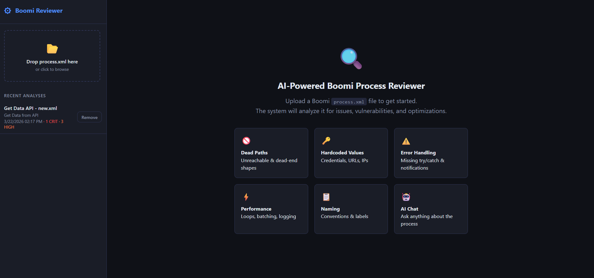
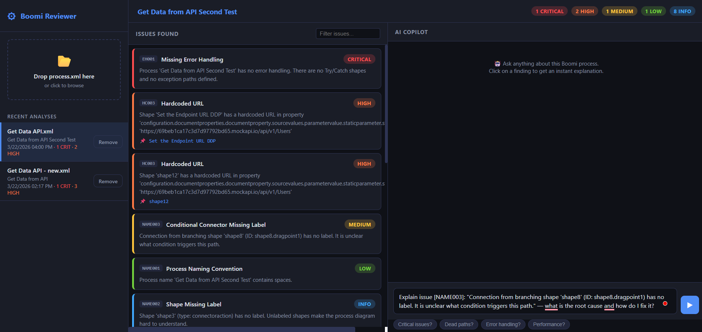
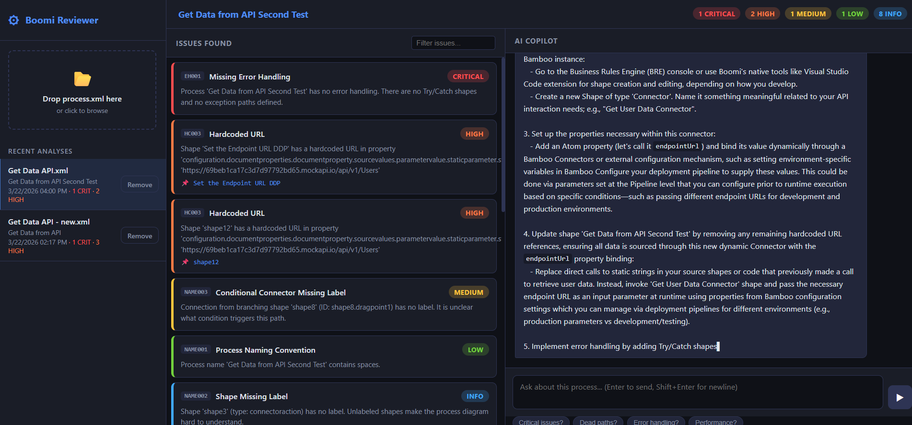
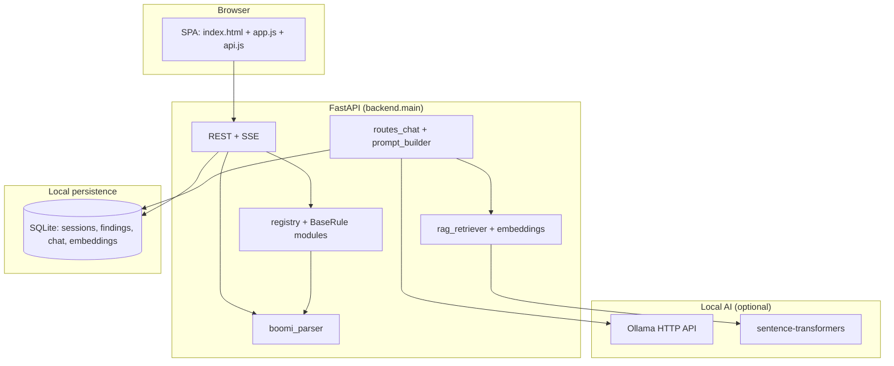

# Boomi Process Reviewer

A local web application that **parses Boomi integration process XML**, runs a **static rule engine** to flag design and security issues, persists results in **SQLite**, and provides an **AI copilot** (via **Ollama**) with optional **RAG** over past chat messages.

---
## Screenshots





## Table of contents

1. [Architecture overview](#architecture-overview)
2. [System components](#system-components)
3. [Data flows](#data-flows)
4. [Parser](#parser)
5. [Rule engine](#rule-engine)
6. [AI layer](#ai-layer)
7. [Database](#database)
8. [REST API](#rest-api)
9. [Frontend](#frontend)
10. [Configuration](#configuration)
11. [Security](#security)
12. [Running the application](#running-the-application)
13. [Development](#development)

---

## Architecture overview

The system follows a **classic three-tier layout**: browser UI → FastAPI backend → SQLite + optional local LLM/embeddings. All heavy analysis is **offline-capable** if Ollama and embedding models are installed locally.



**Technology stack**

| Layer | Technology |
|--------|------------|
| Web framework | FastAPI, Uvicorn |
| XML | lxml |
| Graph algorithms | NetworkX (directed graph for path rules) |
| Validation | Pydantic v2 |
| Database | SQLite via aiosqlite (async) |
| LLM | Ollama-compatible HTTP (`/api/chat`, fallback `/v1/chat/completions`) |
| Embeddings | sentence-transformers (e.g. `all-MiniLM-L6-v2`) |
| Frontend | Static HTML/CSS/ES modules (no build step) |

---

## System components

### Backend layout

| Path | Responsibility |
|------|----------------|
| `backend/main.py` | App factory, CORS, lifespan (DB init), static `/static`, `/` → `index.html`, `/health` |
| `backend/config.py` | Pydantic Settings: DB path, Ollama URL/model, embedding model, `analysis_cache_version`, CORS |
| `backend/parser/` | `boomi_parser.py`, `models.py` (`Shape`, `Connection`, `BoomiProcess`), `graph_builder.py` (NetworkX `DiGraph`) |
| `backend/rules/` | `base_rule.py` (`Finding`), `registry.py` (auto-discovery), category packages (see [Rule engine](#rule-engine)) |
| `backend/api/` | `routes_analysis.py`, `routes_chat.py`, `routes_sessions.py` |
| `backend/ai/` | `ollama_client.py`, `prompt_builder.py`, `rag_retriever.py`, `embeddings.py` |
| `backend/db/` | `schema.sql`, `database.py`, `repo_*.py` |
| `backend/utils/` | `logger.py`, `severity.py` |
| `backend/knowledge/` | Maintainer notes (e.g. Boomi Flow Control semantics) |

### Frontend layout

| Path | Responsibility |
|------|----------------|
| `frontend/index.html` | Shell: sidebar (upload, session list), main (welcome, findings, chat) |
| `frontend/css/styles.css` | Dark theme, severity colors, layout |
| `frontend/js/app.js` | Upload, session UX, findings list, SSE chat, cache removal per session |
| `frontend/js/api.js` | `fetch` wrappers for analyze, sessions, chat, SSE parsing |

---

## Data flows

### 1. Analyze upload (`POST /api/analyze`)

1. Client uploads XML (`multipart/form-data`).
2. Server computes **`SHA-256` over XML bytes + `analysis_cache_version`** (see config). If a row exists with that hash, **cached** session + findings are returned without re-parsing.
3. Otherwise: **parse** → **run all rules concurrently** (thread pool; rules are sync) → **summarize severities** → **insert session + findings**.
4. Response includes `session_id`, `process_name`, `summary`, `findings[]`, `cached` flag.

### 2. Chat (`POST /api/chat`)

1. Load session + findings from DB; build **dummy** `BoomiProcess` with session metadata (findings drive the prompt).
2. Retrieve **RAG** snippets: cosine similarity over **pickled** embedding blobs vs current user message embedding.
3. Assemble messages: system persona, analysis context, RAG block, last 10 chat turns, user message.
4. **Stream** tokens from Ollama (SSE); persist user + assistant messages; embed and store embeddings for future RAG.

### 3. Sessions

- **List** / **get** / **delete** by ID. Deletes cascade to findings, chat, embeddings (FK + `ON DELETE CASCADE`).

---

## Parser

The parser produces a **`BoomiProcess`**: `process_id`, `process_name`, `shapes[]`, `connections[]`, `start_shape_id`.

**Supported XML families**

1. **Legacy connector / automation** (`Process`, `Shape`, `Connection`, Boomi automation namespace).
2. **Boomi platform `Component` export** (`api.platform.boomi.com`): shapes use `name`, `shapetype`, `userlabel`; edges from **`dragpoint/@toShape`** under parent `shape`.

Discovery uses **case-insensitive local tag names** and skips non-element nodes (e.g. comments). **Connections** are merged from legacy `Connection` elements and platform **dragpoint** wiring.

---

## Rule engine

- **Discovery**: `registry.py` imports all `BaseRule` subclasses under fixed subpackages (`dead_paths`, `duplicates`, `hardcoded_values`, `error_handling`, `performance`, `naming_conventions`).
- **Execution**: Rules sorted by **severity weight** (critical first); each `check(process)` runs in a **thread pool**; results aggregated.
- **Output**: Each finding has `rule_id`, `rule_name`, `severity`, `description`, `recommendation`, optional `shape_id` / `shape_label`.

### Implemented rules (16)

| ID | Category | Summary |
|----|----------|---------|
| **DEAD001** | Dead paths | Unreachable shapes (no incoming edge, not start) |
| **DEAD002** | Dead paths | Non-terminal shapes with no outgoing edge |
| **DEAD003** | Dead paths | Disconnected subgraphs |
| **DUP001** | Duplicates | Duplicate connectors |
| **DUP002** | Duplicates | Duplicate shape configurations |
| **HC001** | Hardcoded values | Credential-like keys with non-placeholder values |
| **HC003** | Hardcoded values | URLs/IPs in configuration |
| **EH001** | Error handling | Missing try/catch / error paths (process-level heuristics) |
| **EH002** | Error handling | Unhandled exception patterns |
| **EH003** | Error handling | Missing notify on error |
| **PERF002** | Performance | DB operations without batching heuristics |
| **PERF003** | Performance | Excessive / debug logging patterns |
| **PERF004** | Performance | Unbounded iteration (Flow Control only when `loopType` without cap; document/parallel modes excluded per Boomi semantics) |
| **NAME001** | Naming | Process naming conventions |
| **NAME002** | Naming | Missing shape labels |
| **NAME003** | Naming | Unlabeled branch connectors |

Rules are **heuristic static analysis** of exported XML—not runtime verification on a live Atom.

---

## AI layer

| Module | Role |
|--------|------|
| `ollama_client.py` | Streams chat; resolves model name via `GET /api/tags`; falls back to OpenAI-compatible endpoint; user-facing errors if Ollama/model missing |
| `prompt_builder.py` | System + analysis context from findings (and limited process text) |
| `embeddings.py` | Loads `sentence-transformers` model once; cosine similarity helper |
| `rag_retriever.py` | Top-K similar past messages by embedding; no external vector DB |

---

## Database

- **Engine**: SQLite file (`data/boomi_reviewer.db` by default).
- **Integrity**: `PRAGMA foreign_keys = ON` on each connection.
- **Cascade**: Deleting a session removes dependent findings, messages, embeddings.

**Tables (conceptual)**

| Table | Purpose |
|-------|---------|
| `analysis_sessions` | Session id, display name, original filename, **versioned** XML hash, JSON summary counts, timestamps |
| `rule_findings` | One row per finding, FK to session |
| `chat_messages` | User/assistant text, FK to session |
| `message_embeddings` | Pickled numpy float32 vectors, FK to message id |

Indexes: session id on findings/chat; xml_hash for cache lookup.

---

## REST API

| Method | Path | Description |
|--------|------|-------------|
| `GET` | `/` | Serves SPA `index.html` |
| `GET` | `/health` | `{ status, version }` |
| `GET` | `/static/*` | Static frontend assets |
| `POST` | `/api/analyze` | Multipart file upload → analysis result |
| `GET` | `/api/sessions` | List recent sessions |
| `GET` | `/api/sessions/{id}` | Session row + findings |
| `DELETE` | `/api/sessions/{id}` | Delete session and cascaded data |
| `POST` | `/api/chat` | JSON body `{ session_id, message }` → **SSE** stream |
| `GET` | `/api/chat/history/{session_id}` | Chat history for session |

**CORS**: Middleware allows configured origins (default `["*"]`).

---

## Frontend

- **Upload**: Drag/drop or file picker (`.xml`).
- **Recent analyses**: Lists cached sessions with filename, process name, date, severity hints; **Remove** per row clears server-side session.
- **Findings**: Filter box, severity-colored cards; click prefills chat prompt.
- **Chat**: SSE streaming; optional suggestion chips; history reload per session.
- **Output**: Some chat/finding text passed through `escapeHtml` to reduce HTML injection from displayed content.

---

## Configuration

Environment variables are read from **`.env`** in the **project root** (same folder as `backend/`), via `pydantic-settings`.

| Variable / setting | Purpose |
|--------------------|---------|
| `db_path` | SQLite file path |
| `ollama_base_url` | Ollama base URL (default `http://localhost:11434`) |
| `ollama_model` | Model name (resolved against `ollama list`) |
| `ollama_timeout` | HTTP timeout seconds |
| `embedding_model` | sentence-transformers model id |
| `rag_top_k` | RAG context count |
| `cors_origins` | List of allowed origins |
| `analysis_cache_version` | Bump to invalidate analyze cache when parser/rules change |

---

## Security

This section describes **what the application actually does today**—both **protective behaviors** and **limitations**. It is **not** a certification or penetration-test report.

### Security-related **analysis** (Boomi XML)

The rule engine **flags potential security and compliance issues** in process definitions, for example:

- **HC001**: Patterns suggesting **hardcoded secrets** (password, API key, etc.) in shape properties (with placeholder heuristics to reduce noise).
- **HC003**: **Hardcoded URLs / IPs** where environments should use connections or properties.

These are **static, pattern-based** checks on exported XML. They can **miss** issues or **false positive**; they do not replace secure SDLC, secret scanning in CI, or Boomi platform security settings.

### Data **confidentiality** and **local processing**

- **Default deployment** targets **localhost**: Ollama and embeddings run **on the same machine** as the app, which **reduces** sending Boomi process content to third-party SaaS **if** you keep Ollama local and do not point `ollama_base_url` at an untrusted host.
- **SQLite** stores: process names, filenames, rule findings, **full chat transcripts**, and **embeddings** derived from chat. **Protect the database file** (`data/` directory) with OS permissions and disk encryption as appropriate.
- **Embeddings** are stored as **pickled blobs** in SQLite—not encrypted at rest by the application.

### Authentication and authorization

- **There is no login**, **no API keys**, and **no role-based access control**. Any client that can reach the HTTP port can call **analyze**, **chat**, **list/delete sessions**.
- **Do not expose** the Uvicorn port to the public internet without adding **reverse proxy authentication**, **TLS**, **network ACLs**, or similar controls.

### Transport security

- The default command runs **HTTP** (`http://localhost:8000`). **TLS is not terminated** in the app. For remote access, terminate **HTTPS** at a reverse proxy or VPN.

### CORS

- Default **`cors_origins = ["*"]`** is permissive. For locked-down deployments, set **`CORS_ORIGINS`** in `.env` to explicit origins (format depends on pydantic list parsing—typically JSON array string or repeated env conventions per your deployment).

### Input validation and resource limits

- XML is parsed with **lxml**; invalid XML returns **422**.
- **No explicit maximum upload size** is enforced in application code; large files could stress memory. Use **reverse proxy limits** or extend the API with size checks if needed.
- **Chat** history passed to the LLM is **bounded** (e.g. last N messages in prompt builder); RAG uses top-K.

### Dependency and supply chain

- Python dependencies are pinned in `backend/requirements.txt`. Keep them updated for CVEs.
- **Ollama models** are user-managed (`ollama pull`).

### Frontend

- **escapeHtml** is used in parts of the UI to mitigate **XSS** when rendering user- or model-generated text. Not every string path may be equally hardened; treat the UI as **defense in depth**, not the sole security boundary.

### Secrets in configuration

- **`.env`** may hold no secrets by default, but if you add API keys, **never commit** `.env` to source control. Add `.env` to `.gitignore` (recommended).

---

## Running the application

```bash
cd /path/to/Boomi-Reviewer
pip install -r backend/requirements.txt
```

Install **Ollama**, pull a model (e.g. `ollama pull phi3`), align `OLLAMA_MODEL` in `.env` if needed.

```bash
python -m uvicorn backend.main:app --host 0.0.0.0 --port 8000 --reload
```

On Windows, `start.bat` can be used to install dependencies and start the server.

Open **http://localhost:8000**, upload a Boomi `process.xml` or platform **`Component`** export, and review **Issues Found** and **AI Copilot**.

---

## Development

- **Tests**: `pytest` in `tests/` (parser + rule smoke tests).
- **Adding a rule**: Subclass `BaseRule` in an existing category package; ensure `registry` subpackage list includes it; restart server.
- **Cache invalidation**: Bump `analysis_cache_version` in `config.py` when parser or rule semantics change materially.

---

## License / project context

University / project use; adapt licensing as required by your institution.
